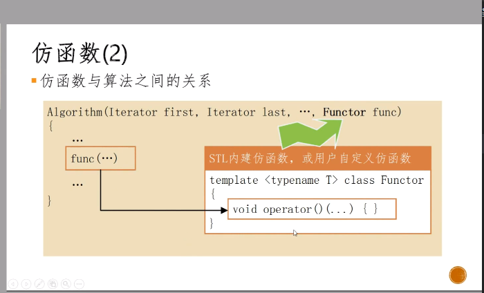
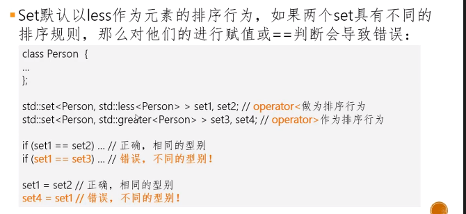
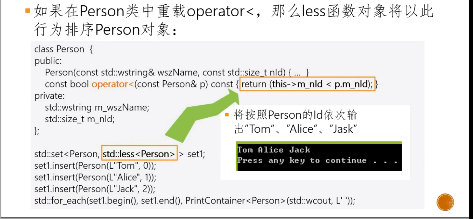
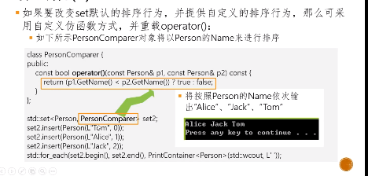

仿函数又称为函数对象（Function Object），其作用相当于一个函数指针
比如remove_if,输入参数ContainString即为仿函数
```C++
std::temove_if(v.being(), v.end(), ContainsString(L"C++"));
```
要将某种“行为”作为算法的参数（此处的行为是：判断字符串中是否存在“C++”这几个字符），就需要将该“行为”函数指针作为算法的参数
STL中奖这种行为函数指针定义为所谓的仿函数，其实现是一个class，再以该仿函数产生一个对象作为算法参数。

仿函数的类别定义中必须重载函数调用（function call）运算子operator(),从而使得仿函数对象可以像函数一样被调用

自定义的仿函数必须重载operator()

```c++
int buffer[BufferSize] = {0, 100, -98, 31, 7};
std::vector<int> v(buffer, buffer + BufferSize);
std::for_each(v.begin(), v.end(), PrintContainer<int>(std::cout));


template<typename T> struct PrintContainer{
    PrintContainer(std::ostream& out) : os(out){};
    void operator()(const T& x){os << x <<';'};
    std::ostream& os;
};
```

为什么要用仿函数而不用普通函数指针作为算法的行为参数？
普通函数指针不能满足STL的抽象要求。比如怎么定义该函数指针呢？参数和返回型别如何指定？

仿函数可作为模版实参用于定义对象的某种默认行为


