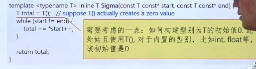
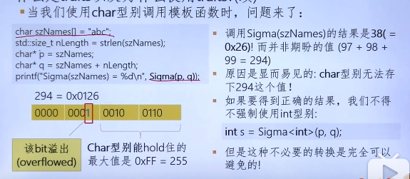

# 泛型编程
泛型编程（Generic programming）是一种编程方法，这种方法将型别（type）以一种to-be-specificed-later的方式给出，等到需要调用的时候，再以参数方式，通过具体的、特定的型别实例化一个具体的方法或对象

# Traits


解决办法：为每个Sigma函数的参数型别T创建一种关联（association），关联的型别就是用来存储Sigma结果的型别
这种关联可以看做是型别T的一种特性（characteristic of the type T），因此Sigma函数返回的型别叫做T的traits
## T与其trait的关系推演如下：
T->association->characteristic of T-> another type -> traits

Trait可以实现为模版类，而关联则是针对每个具体的型别T的*特化*。在这个例子里我们将traits命名为SigmaTraits，叫做traits模板

```c++
template<typename T> class SigmaTraits {};
template<> SigmaTraits<char>{
public: typedef int ReturnType;
};
template<> SigmaTraits<short>{
public: typedef int ReturnType;
};
template<> SigmaTraits<int>{
public: typedef long ReturnType;
};
template<> SigmaTraits<unsigned int>{
public: typedef unsigned long ReturnType;
};
template<> SigmaTraits<float>{
public: typedef double ReturnType;
};
```

模版类SigmaTraits叫做traits template， 它包含其参数型别T的一个特性（trait），即ReturnType；
```c++
template <typename T>
inline typename SigmaTraits<T>::ReturnType Sigma(const T const* start, const T const* end){
    typedef typename SigmaTraits<T>::ReturnType ReturnType;
    ReturnType s = ReturnType();
    while(start!= end)
        s+= *start++;
    return s;
}
```