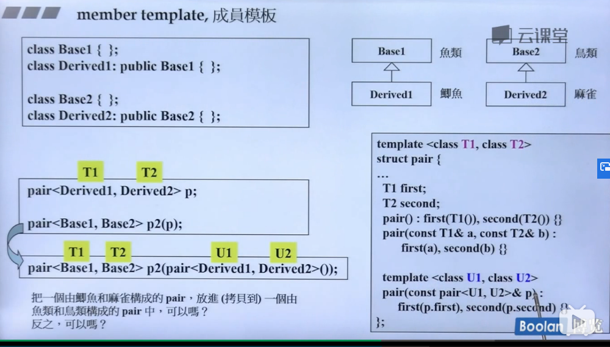

template<class T1, class T2>
struct pair{
    T1 first;
    T2 second;
    pair(): first(T1()), second(T2()){}
    pair(const T1& a, const T2& b):first(a), first(a), second{}
    template<class U1, class U2>
    pair(const pair<U1, U2>): first(p.first), second(p.second){}
}
使构造函数更有弹性 