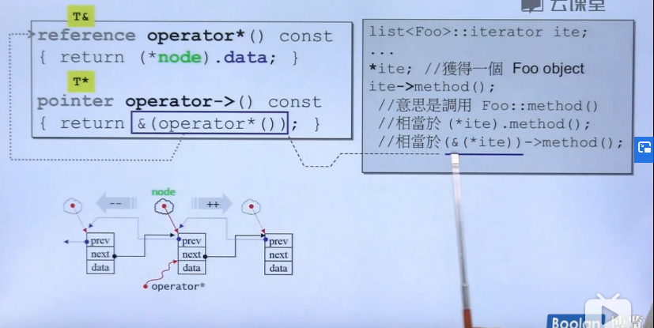

pointer-like classes,
## 智能指针
什么样的操作符作用在指针 
``` c++
template<class T>
class shared_ptr
{
public:
    T& operator*() const
    {return *px;}
    T* operator->() const
    {return px;}
    shared_ptr(T* p) : px(p){}
private:
    T* px;
    long* pn;
...
}
struct Foo{
    .......
    void methed(void) {......}
};
shared_ptr<Foo> sp(new Foo);
Foo f(*sp);
sp->method();//这里sp->method()等价于px->method(),    ->这个操作符很特殊，会一直作用下去
```
## 迭代器
相当于智能指针
链表的代码
```c++
template<class T, class Ref, class Ptr>
struct __list_iterator{
    typefef  __list_iterator<T, Ref, Ptr> self;
    typedef Ptr pointer;
    typedef Ref reference;
    typedef __list_node<T>* link_type;
    link_tyoe node;
    bool operator==(const self& x})const {return node == x.node};
    bool operator!=(const self& x) const {return node != x.node};
    reference operator*()const { return (*node).data;}
    pointer operator->() const{return &(operator*());}
    self& operator++() {node = (link_type) ((*node).next); return *this;}
    self operator++(int) { self tmp = * this; ++*this; return tmp;}
    self& operator--(){node = (link_type)((*node).prev); return *this;}
    self operator--(int) { self tmp =* this; --*this; return tmp;}
    };

    template<class T>
    struct __list_node{
        void* prev;
        void* next;
        T data;
    };


```
