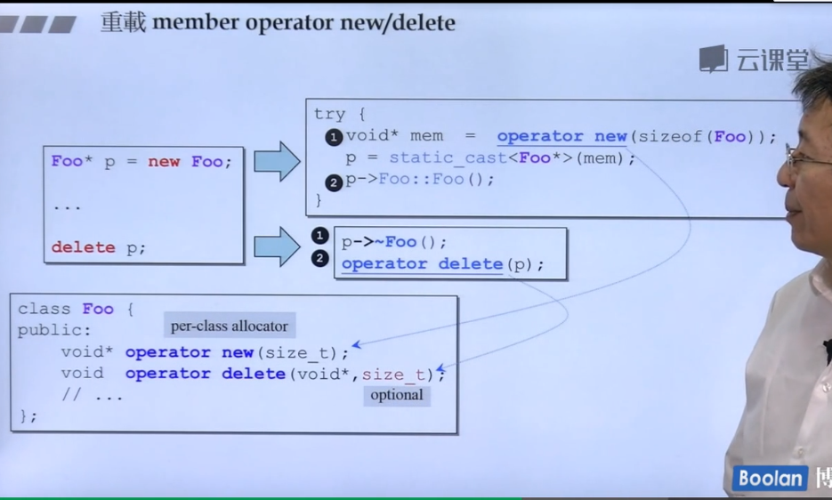

## 重载全局的new和delete


## 重载classmember的new和delete



示例


图示为
```
Foo* pArray = new Foo[5];
delete[];
```
上面的没有虚函数，int,long都是4个字节，string是指针也是4个字节，加起来总共12个字节，调用5次，5*12=60，然后还有个counter记录有几次展4字节，总共就是60+4=64。
下面的多个虚函数多加4个字节就是16*5+4 = 84字节。


上面在前面加上::就是强制使用global version的new和delete。

## 重载new（）
class member operator new()可以写出多个版本，但是声明都必须有独特的参数列，其中第一参数必须是size_t，其余参数以new所指定的placement arguments为初值。

```
Foo* pf = new(300, 'c') Foo;
```

## 重载delete（）
也可以重载class member operator delete()，写出多个版本，但他们不会被delete调用，只有当new锁调用的ctor跑出exception，才会调用这些重载版的operator delete()。他只能被这样调用，主要用于来归还未能完全创建成功的object所占用的memory。


即使operator delete(...)未能一一对应于operator new(...)，也不会报错，你的意思是：放弃处理ctor发出的异常。