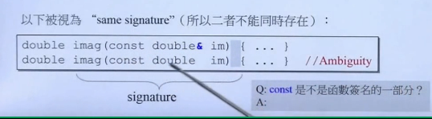

```c++
typedef struct Stag { int a,b,c,d;} S;
int main(){
    double x=0;
    double* p = &x;//p指向x,p的值是x的地址
    double& r= x;//r代表x,现在r，x都是0
    cout<< sizeof(x) << endl;  //8
    cout << sizeof(p) << endl; //4
    cout << sizeof(r) << endl; //8
    cout << p << endl;//0065FDFC
    cout << *p << ndl;//0
    cout << x << endl;//0
    cout << r << endl;//0
    cout << &x<< endl;//0065FDFC
    cout << &r << endl;//0065FDFC

    S s;
    S& rs =s;
    cout << sizeof(s) <<endl; //16
    cout << sizeof(rs) <<endl; //16
    cout << &s<<endl; //0065FDE8
    cout << &rs<<endl; //0065FDE8
}
```
obeject和其reference的大小相同，地址也相同（全都是假象）

reference通常不用于声明变量，而用于参数类型（parameters type)和返回类型(return type)的描述

A：是的