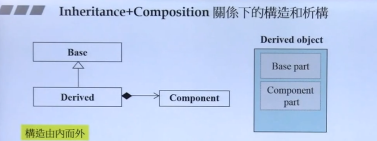

# Inheritance关系下的构造和析构

构造由内而外
Derived的构造函数首先调用Base的dafault构造函数，然后才执行自己。
Derived::Derived(...):Base(){...};

析构由外而内
Derived的析构函数首先执行自己，然后才调用Base的析构函数
Derived::~Derived(...){...~Base()}

# Composition(复合)关系下的析构和构造

构造由内而外
Container的构造函数首先调用Compon的default的构造函数然后才执行自己
Container::Container():Component(){...};

析构由外而内
Container的析构函数首先执行自己，然后再调用Component的析构函数
Container::~Container(...){... ~Component()};

# Inheritance+COmposition关系下的构造和析构

构造由内而外
Derived的构造函数首先调用Base的default构造函数，然后调用Component的default构造函数，
然后才执行自己。
Derived::Derived(...):Base()，Component(){...};
析构由外而内
Derived的析构函数首先执行自己，然后才调用Component的析构函数,然后调用Base的析构函数。
Derived::~Derived(...){...~Component(),~Base()};
