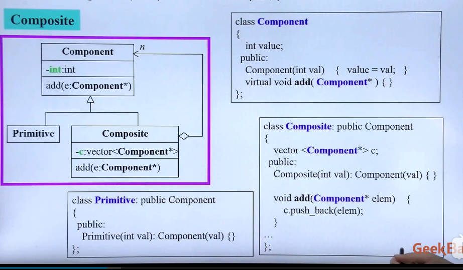
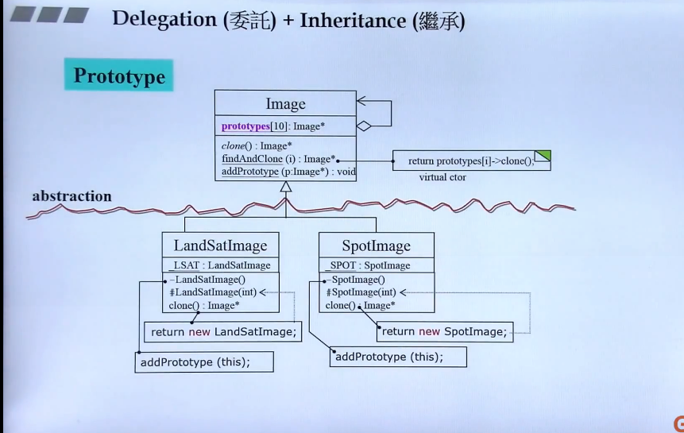

pimpl

observer

# composite

左边是Primitive基础物，右边Composite复合物都继承于父类Component,但Composite可以包含Primitive
注意Component类中的add函数不能设计为纯虚函数,如果是纯虚函数的话，子类必须重新定义add函数，而primitive不用add函数    
composite由delegation和委托构成

# Prototype

在父类中不知道未来子类是怎么样的，可以用protoytpe这种设计模式
在子类中要用静态函数，clone函数